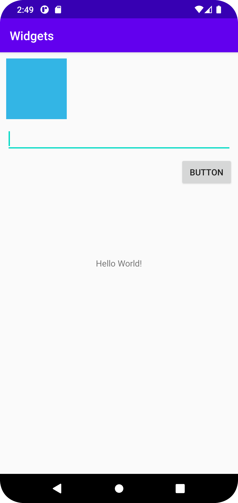

# Rapport

I denna uppgift har jag skapat en constraint layout i Design.

Ex. Denna kod används för constraint layout

<androidx.constraintlayout.widget.ConstraintLayout

Jag har sedan skapat en knapp, en Edit text och en Imageview. 

android:src="@android:color/holo_blue_light"

Denna kod används för knappen då den inte ska ha någon bild utan en blå färg.
Jag har även satt margin på knappen, enligt uppgiftsinstruktioner (minst en ska ha margin).

android:layout_margin="10dp" // kod för margin på knapp

För att positionera mina widgets så de inte ser lika ut som från början har jag använt tex:

android:layout_width="100dp"
android:layout_height="100dp" 

för att välja längd och höjd på bilden. 

